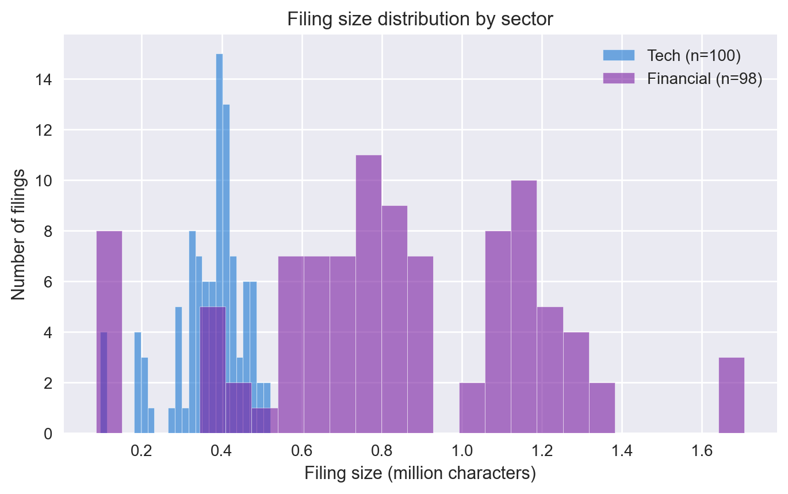
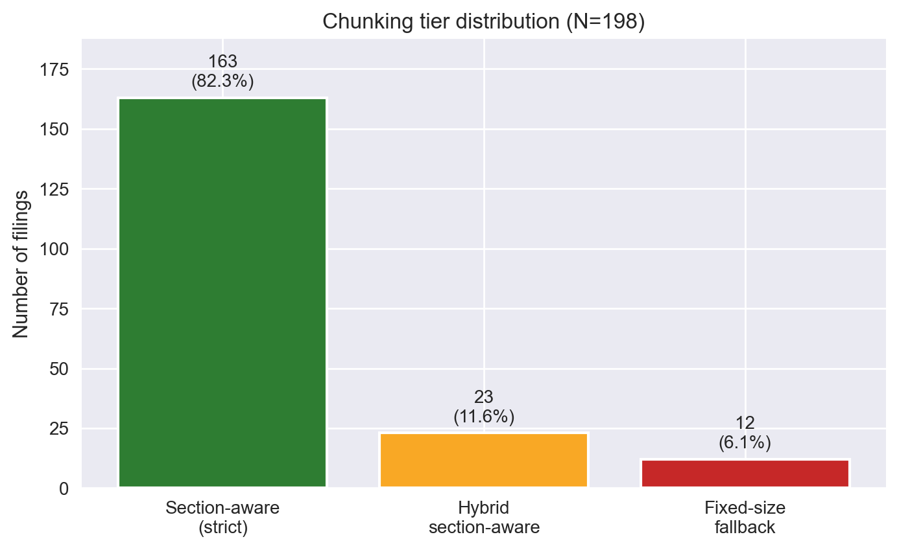
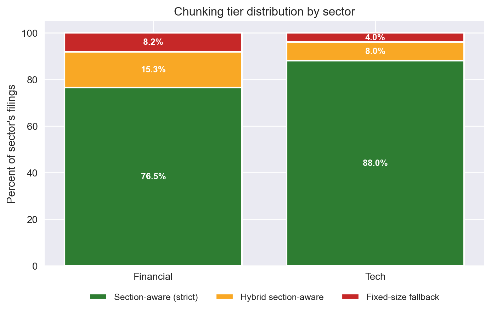
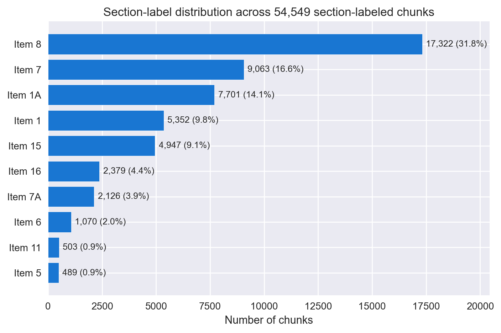
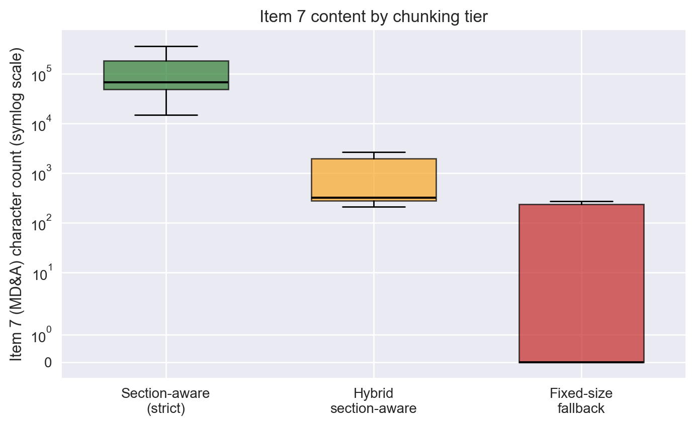
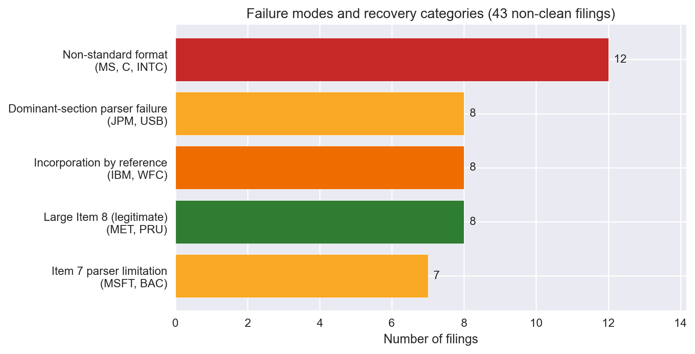

# FinRAG-Eval — Exploratory Data Analysis Report (v0.1 Corpus)

**Authors:** Mayank Bhardwaj, Harshmeet Kaur, Vidhee Patel
**Course:** MISM 6214 — Summer 2026 Capstone
**Date:** May 28, 2026

---

## 1. Data Acquisition & Description

Our project asks how AI can help analysts retrieve and interpret SEC filings with verifiable evidence. The corpus is the foundation of that question — what we can answer well depends entirely on what we have and how cleanly we can work with it.

We acquired 198 annual reports (Form 10-K) from 50 publicly traded companies through the SEC's EDGAR system, spanning filing years 2022–2026. The corpus splits roughly evenly across two sectors — 27 technology companies (100 filings) and 23 financial-services companies (98 filings) — and produces 59,822 retrieval-ready chunks totaling approximately 117 million characters of cleaned filing text. Each filing carries metadata (ticker, filing year, accession number, sector) in a stable manifest that downstream analysis depends on.

### Deviations from the original plan

The actual corpus differs from Assignment 1 in several respects. Each deviation reflects a deliberate choice made after confronting the real data.

| Dimension | Original Plan | v0.1 Reality | Reason |
|---|---|---|---|
| Companies | 30 | 50 | Larger coverage strengthens sector-level comparison |
| Filing types | 10-K + 10-Q | 10-K only | Scoped down to develop methodology against 10-K complexity first |
| Years | 3 (2022–2024) | 4 (2022–2026 filing dates) | Natural index for EDGAR |
| Filings target | 360–450 | 198 | 10-K-only and per-company calendar variation reduce count |
| Chunking strategies | 2 (fixed-size, section-aware) | 3 tiers (added a middle category) | Empirical observation forced a refinement (Section 2) |
| QA pairs target | ~100 | 10 calibration pairs | Walked back ambitious target — see Section 5 |

The QA target deserves explicit mention. After building 10 verified evidence-grounded pairs, we concluded that hand-curating 100 such pairs at quality was not realistic in the project timeline. We have restructured the QA workstream into a phased plan that prioritizes verified evidence over raw count.

---

## 2. Data Quality Assessment

For an analyst-facing retrieval system, the question is not whether documents downloaded — it is whether the corpus can reliably support the kinds of questions analysts actually ask. We assessed four quality dimensions:

**Completeness.** All 198 filings downloaded successfully. The more important completeness question is structural: do filings parse into the SEC-defined Items (Item 1 Business, Item 1A Risk Factors, Item 7 MD&A, Item 8 Financial Statements, etc.) needed for targeted retrieval? Initial parsing showed about 80% of filings parsing cleanly into all major Items, with the remaining 20% landing in a fallback bucket. Closer inspection showed this binary view was hiding meaningful structure: a middle category of filings whose sections detect with non-fatal anomalies. We split the corpus into three tiers — **section-aware** (clean parse, 163 filings, 82.3%), **hybrid section-aware** (sections detect but with anomalies the relaxed rule admits, 23 filings, 11.6%), and **fixed-size fallback** (12 filings, 6.1%). Combined usable coverage is **93.9% of the corpus**, a meaningful gain over the 80% baseline.

**Accuracy.** Two issues surfaced. First, modern 10-Ks contain inline XBRL tags that contaminate the first several thousand characters of every filing with technical markup; we patched the extraction path to strip these elements and verified the fix on 20 spot-checked filings. Second, we confirmed section detection works as labeled by comparing Item 7 (MD&A) content across the three tiers: clean filings show robust Item 7 content (median ~67,000 characters); hybrid-tier filings show partial detection (~300 characters); fallback-tier filings have none. The tier classification reflects real structural differences, not arbitrary labels.

**Consistency.** Rather than treat non-clean filings as a generic fallback, we characterized them by root cause. Twelve filings have non-standard formats (MS, C, INTC); eight rely on incorporation-by-reference (IBM, WFC); eight show dominant-section parser failures (JPM, USB); seven have Item 7-specific parser limitations (MSFT, BAC); and eight are recoveries — filings whose large Item 8 sections are legitimate document content rather than parser artifacts (MET, PRU, other insurers). This taxonomy turns a 6.1% data-quality problem into a 6.1% characterized edge-case set, with concrete guidance for which filings support which question types.

**Timeliness.** Filings span 2022–2026 with approximately even distribution across 2022–2025 and FY2026 still rolling in. One temporal anomaly is worth flagging: Item 1C (Cybersecurity) appears in only 132/198 filings because it became an SEC requirement for fiscal years ending after December 2023. Any question targeting cybersecurity disclosures must restrict to filings from those years.

### Summary quality table

| Dimension | Finding | Action |
|---|---|---|
| Acquisition completeness | 100% (198/198) | — |
| Section-label completeness | 93.9% (186/198) | Three-tier classification; non-clean filings characterized by root cause |
| XBRL contamination | Found in all filings | Extraction patched; verified on 20 spot-checked filings |
| Section detection accuracy | Validated per tier | Item 7 character distribution confirms tier classification |
| Consistency (schema) | Stable manifest | All downstream code reads a single quality contract |
| Item 1C temporal coverage | 132/198 filings (post-2023) | QA construction restricts Item 1C questions to FY2024+ |

### Remaining limitations

The 12 fixed-size filings carry no section labels and are excluded from Item-specific question targeting. Retrieval performance differences between the strict and hybrid tiers remain untested (planned robustness check). The corpus is 10-K only; 10-Q content is deferred.

---

## 3. Exploratory Analysis & Visualizations

**Figure 1.** Tech filings cluster around 0.3–0.5 million characters; financial filings stretch to 1.5+ million with a long right tail. Financial 10-Ks are roughly 2.25× larger on average, which means retrieval must contend with more candidate text per filing in the financial sector.

**Figure 2.** Three-tier chunking distribution. Strict section-aware accounts for 82.3% of filings; the relaxed hybrid tier recovers an additional 11.6% that would otherwise have been treated as fallbacks; only 6.1% require fixed-size fallback.

**Figure 3.** Tech filings parse cleanly into the strict tier 88.0% of the time; financial filings reach 76.5%. The 11.5-point gap reflects that financial 10-Ks more often contain non-standard structural elements — incorporation by reference, large Item 8 sections from insurers, and dominant-section parser failures from large bank holding companies.

**Figure 4.** Item 8 (Financial Statements) dominates at 31.8% of section-labeled chunks; Item 7 (MD&A), Item 1A (Risk Factors), and Item 1 (Business) follow. Together, these four Items account for over 75% of retrievable text — and roughly match where analyst questions concentrate (financial performance, risk, strategy, business overview).

**Figure 5.** Item 7 (MD&A) character count by tier, log scale. The visible separation across tiers — robust content in strict, partial in hybrid, none in fallback — empirically validates the three-tier classification: filings in different tiers genuinely differ in retrievable content, not just labels.

**Figure 6.** Distribution of the 43 non-clean filings across four named failure modes plus one recovery category. The largest single category is filings recovered by the relaxed rule (large Item 8 from insurers); the next is non-standard format (MS, C, INTC). Each named mode points to a different root cause and a different downstream consequence for retrieval.

---

## 4. Key Findings & Insights

**1. Three-tier chunking outperforms binary classification.** Assignment 1 committed to "two chunking strategies (fixed-size vs. section-aware)" with the implicit assumption that filings fall cleanly into one or the other. Reality required a middle tier. We now have **93.9% section-labeled coverage** instead of ~80%, on the same underlying corpus, with no fundamental change to the research question.

**2. Financial and tech filings differ structurally — sector matters as an analysis dimension.** The original plan treated the two sectors as equivalent corpora. The data shows otherwise: financial filings are 2.25× larger on average, contain 3.1× more Item 7 (MD&A) content, and parse cleanly 11.5 points less often than tech. Section-aware chunking provides proportionally more benefit on financial filings because there is simply more substantive section-labeled content per filing. Sector should be treated as an explicit dimension in retrieval analysis, not collapsed into a single corpus statistic.

**3. Failure modes are company-specific, not year-specific.** Of the 8 companies that fail to parse cleanly in multiple years, 7 fail identically across all years they appear. MS, IBM, and similar issuers fail the same way every year. This means parser improvements can be targeted at specific issuers, and future corpus expansion can predict roughly which new filings will succeed or fail based on the ticker alone. Assignment 1's general "filings vary in structure" framing understated this regularity.

**4. Item 1C (Cybersecurity) sparseness imposes question-construction constraints the plan did not anticipate.** Item 1C only appears in 132/198 filings because it is a 2024-onward SEC requirement. Any QA pair targeting cybersecurity disclosures must restrict to filings from those years. This was not foreseen in Assignment 1 and is now a documented constraint in the QA construction playbook. Similar timing-related caveats apply less severely to a handful of other Items.

**5. Early retrieval results validate the multi-retriever design.** As a pipeline-readiness check we ran preliminary retrieval evaluation on the 10 calibration QA pairs. The lexical baseline (BM25) achieved 20% Recall@10; dense retrieval lifted that to 50%; hybrid (BM25 + dense via reciprocal rank fusion) reached 60%. The lift came primarily from questions where filings use legal-template language ("The Company's") and questions use natural language ("Apple's") — a vocabulary mismatch dense retrieval addresses through semantic matching. These are preliminary numbers on a small calibration set, but they directionally confirm the multi-retriever design from Assignment 1.

---

## 5. Updated Analysis Plan

EDA confirms the research design from Assignment 1 — comparing retrieval architectures across chunking strategies on SEC 10-K QA — while requiring three specific refinements.

**Primary experimental subset is 186 section-labeled filings, not all 198.** The 12 unlabeled fixed-size filings are excluded from the headline section-aware-vs-fixed-size comparison to avoid conflating two distinct effects (chunking strategy and parser quality). A secondary sensitivity analysis will rerun the primary comparison on the strict-only subset (163 filings) to verify the headline finding does not depend on the recovery tier.

**Item-specific constraints documented in the QA playbook.** Item 7 questions avoid MSFT, BAC, IBM, WFC, JPM, USB filings. Item 1C questions restrict to FY2024+. Fixed-size filings (MS, C, INTC) excluded from Item-specific QA targeting.

**QA dataset expansion is the near-term priority.** The 100-pair target from Assignment 1 was ambitious; we are stepping it back into a phased plan: 10 calibration pairs complete (Phase 1); ~20 pairs with better question-type balance in progress (Phase 2); further expansion toward 50–75 pairs if time allows (Phase 3). The cross-encoder reranking layer planned in Assignment 1 remains future work — we will add it once the BM25/Dense/Hybrid baseline produces stable numbers on N ≥ 30 QA pairs.

**Open risks.** (1) 10-Q content deferred; if needed for the final demonstration, additional ingestion is required. (2) Numerical-reasoning and multi-document-synthesis question types are under-represented in the calibration set and must be rebalanced in Phase 2. (3) The fixed-size filings remain effectively invisible to Item-specific retrieval; acceptable for the headline experiment but should be acknowledged in the final report.

---

## Contributions

- **Mayank Bhardwaj** (Data & Application Lead): data acquisition, quality-aware chunking methodology, corpus characterization, EDA notebook, this report.
- **Harshmeet Kaur** (Evaluation Lead): QA dataset construction (10 calibration pairs to date), QA construction playbook, calibration validation.
- **Vidhee Patel** (Retrieval & Modeling Lead): retrieval module design and BM25 retriever implementation. Dense retriever was completed on an interim basis by Mayank during Vidhee's unavailability and will be reviewed on her return.